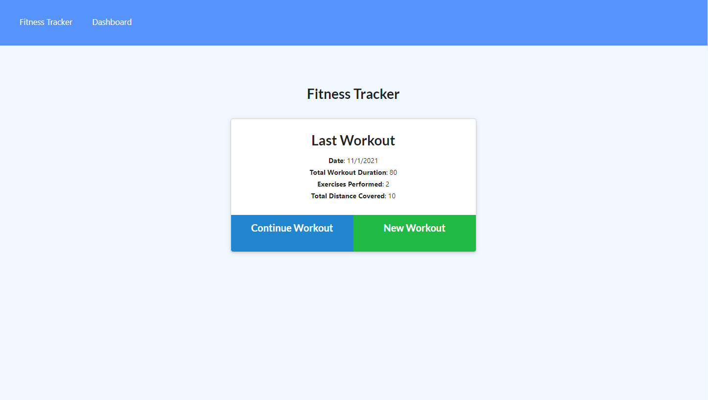
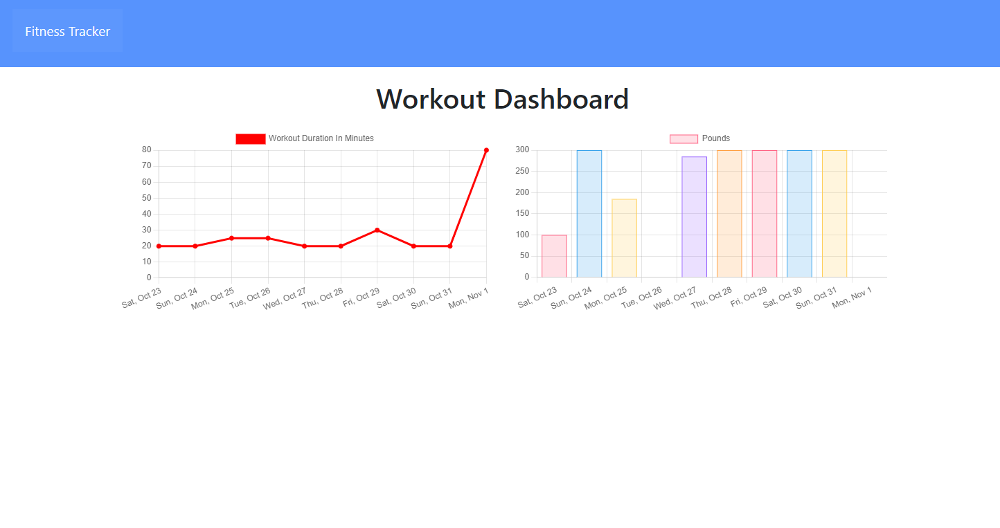

# Fitness-Tracker

## Description

This application is a simple workout tracker. Users can enter data into the dropdown menus and give the duration of their workout, specifiy what kind of work they did (cardio or resistance), give the miles travelled, and specify reps/sets for resistance work. The Dashboard aggregates the user's stats on graphs for easy viewing and tracking of the previous 7 workouts.

Here are screenshots of the app's two primary pages:

Here is a link to the Heroku deployment: [Fitness Tracker Heroku Deployment](https://radiant-hamlet-33556.herokuapp.com/)

## Table of Contents

-- [Installation](#installation)

-- [Usage](#usage)

-- [License](#license)

-- [Contributing](#contributing)

-- [Tests](#tests)

-- [Questions](#questions)

## Installation

Nothing needs to be installed on the Heroku deployment. The app will function upon navigation to the address. However, if the repo will be cloned to your local machine for usage on your own localhost:

To install necessary dependencies, run the following command:

    npm i

This app uses mongoDB and mongoose. To seed the database with the samples provided, run the following command in your terminal:

    node seeders/seeds.js

## Usage

Navigate to the Heroku link provided above to get to the deployed app.

Again, if the repo is cloned to your machine and all the necessary devices are installed, your localhost can be spun up using the command

    node/server.js

Once done, simply click on New Workout to begin logging workouts. Continue Workout can be clicked as well to add exercises to an exisiting workout. Click Complete and your workout will be logged to the database. Then, clicking on Dashboard will allow the user to see all of the workouts from the last 7 entered and the graphs will populate with the total weight lifted in and total duration of those workouts.

## License

This project is protected under the [MIT](https://choosealicense.com/licenses/mit/) license. (2021) (Phil Bohn)

## Contributing

N/A

## Tests

N/A

## Questions

If there any questions regarding this project, I can be contacted in the following places:

GitHub: [@lamperouge1218](https://github.com/lamperouge1218)

Email: philbohn1791@gmail.com
